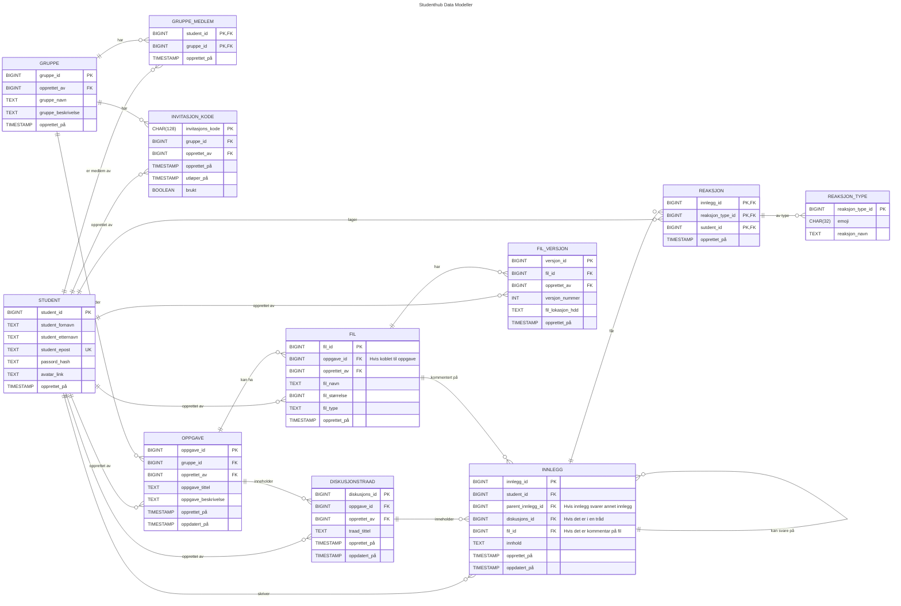

```mermaid
---
title: "Studenthub Data Modeller"
---
erDiagram
    DIRECTION LR
    
    STUDENT {
        BIGINT student_id PK
            
        TEXT student_fornavn
        TEXT student_etternavn
        TEXT student_epost UK
        TEXT passord_hash
        TEXT avatar_link
        TIMESTAMP opprettet_på
    }
    
    GRUPPE {
        BIGINT gruppe_id PK
            
        BIGINT opprettet_av FK
            
        TEXT gruppe_navn
        TEXT gruppe_beskrivelse
        TIMESTAMP opprettet_på
    }
    
    GRUPPE_MEDLEM {
        BIGINT student_id PK,FK
        BIGINT gruppe_id PK,FK
        TIMESTAMP opprettet_på
    }

    INVITASJON_KODE {
        CHAR(128) invitasjons_kode PK
            
        BIGINT gruppe_id FK
        BIGINT opprettet_av FK
        
        TIMESTAMP opprettet_på
        TIMESTAMP utløper_på
        BOOLEAN brukt
    }
    
    OPPGAVE {
        BIGINT oppgave_id PK
        
        BIGINT gruppe_id FK
        BIGINT opprettet_av FK
            
        TEXT oppgave_tittel
        TEXT oppgave_beskrivelse
            
        TIMESTAMP opprettet_på
        TIMESTAMP oppdatert_på
    }
    
    DISKUSJONSTRAAD {
        BIGINT diskusjons_id PK
        
        BIGINT oppgave_id FK
        BIGINT opprettet_av FK
        
        TEXT traad_tittel

        TIMESTAMP opprettet_på
        TIMESTAMP oppdatert_på
    }
    
    %% TODO: Innlegg - CHECK (diskusjons_id IS NOT NULL XOR fil_id IS NOT NULL)
    INNLEGG {
        BIGINT innlegg_id PK
        
        BIGINT student_id FK
        BIGINT parent_innlegg_id FK "Hvis innlegg svarer annet innlegg"
        BIGINT diskusjons_id FK "Hvis det er i en tråd"
        BIGINT fil_id FK "Hvis det er kommentar på fil"        

        TEXT innhold
            
        TIMESTAMP opprettet_på
        TIMESTAMP oppdatert_på
    } 
    
    REAKSJON {
        BIGINT innlegg_id PK,FK
        BIGINT reaksjon_type_id PK,FK
        BIGINT sutdent_id PK,FK

        TIMESTAMP opprettet_på
    }
    
    REAKSJON_TYPE {
        BIGINT reaksjon_type_id PK
        CHAR(32) emoji
        TEXT reaksjon_navn
    }
    
    FIL {
        BIGINT fil_id PK
        
        BIGINT oppgave_id FK "Hvis koblet til oppgave"
        BIGINT opprettet_av FK
            
        TEXT fil_navn
        BIGINT fil_størrelse
        TEXT fil_type
            
        TIMESTAMP opprettet_på
    }
    
    FIL_VERSJON {
        BIGINT versjon_id PK
        
        BIGINT fil_id FK
        BIGINT opprettet_av FK
            
        INT versjon_nummer
        TEXT fil_lokasjon_hdd
            
        TIMESTAMP opprettet_på
    }
    
    STUDENT ||--o{ GRUPPE_MEDLEM : "er medlem av"
    STUDENT ||--o{ INNLEGG : "skriver"
    STUDENT ||--o{ REAKSJON : "lager"
    STUDENT ||--o{ OPPGAVE : "opprettet av"
    STUDENT ||--o{ DISKUSJONSTRAAD : "opprettet av"
    STUDENT ||--o{ FIL : "opprettet av"
    STUDENT ||--o{ FIL_VERSJON : "opprettet av"
    STUDENT ||--o{ INVITASJON_KODE : "opprettet av"
    
    GRUPPE ||--o{ GRUPPE_MEDLEM : "har"
    GRUPPE ||--o{ OPPGAVE : "inneholder"
    GRUPPE ||--o{ INVITASJON_KODE : "har"
    
    OPPGAVE ||--o{ DISKUSJONSTRAAD : "inneholder"
    OPPGAVE ||--o{ FIL : "kan ha"
    
    DISKUSJONSTRAAD ||--o{ INNLEGG : "inneholder"
    
    INNLEGG ||--o{ INNLEGG : "kan svare på"
    INNLEGG ||--o{ REAKSJON : "får"
    
    REAKSJON ||--o{ REAKSJON_TYPE : "av type"
    
    FIL ||--o{ FIL_VERSJON : "har"
    FIL ||--o{ INNLEGG : "kommentert på"
```
